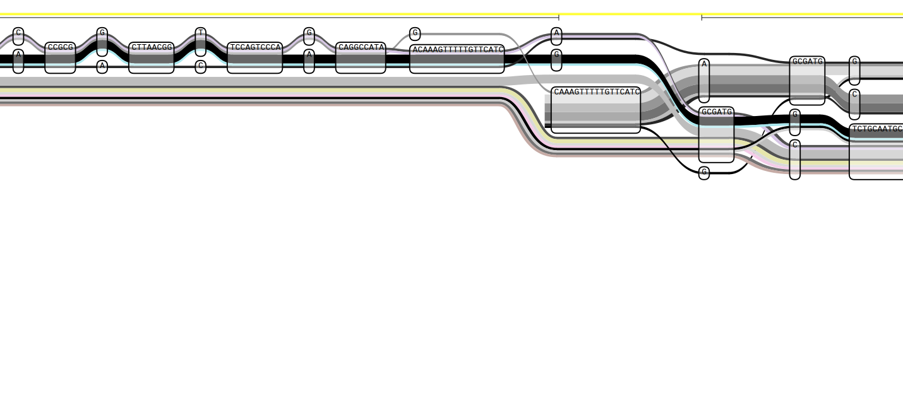
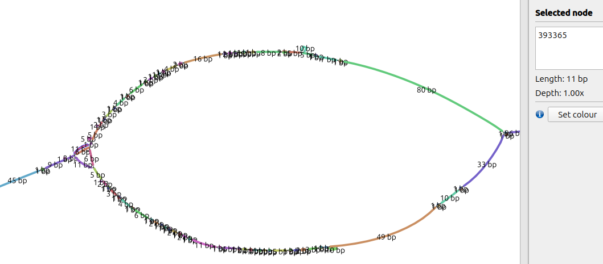

# Escherichia Coli Sequence Visualisation




---

### Download data files

```bash
# downloads ~2200 fna.gz files
curl -L https://raw.githubusercontent.com/pangenome/pggb/master/docs/data/ecoli.urls -o ecoli.urls
cat ecoli.urls | xargs -P 4 -I {} sh -c 'wget -q "{}" && echo got "{}"'
```

### PanSN-spec names
- To change the sequence names according to PanSN-spec, use `fastix`:

```bash
for f in files/*.fna.gz; do
    # Get just the filename (e.g., GCA_011853505.2.fna.gz)
    base=$(basename "$f")
    
    # Extract the sample name (GCA_011853505.2)
    sample_name=$(echo "$base" | cut -f 1,2 -d '_')
    
    echo "Processing: ${sample_name}"

    # Run the command, outputting directly into the rename_files folder
    fastix -p "${sample_name}#1#" <(zcat "$f" | cut -f 1) | \
    bgzip -@ 4 -c > "rename_files/${sample_name}.fa.gz"
done
```

### Combine and Index

```bash
cat rename_files/*.fa.gz > ecoli_pangenome.fa.gz
samtools faidx ecoli_pangenome.fa.gz

# check PanSN-spec renamed headers
zcat ecoli_pangenome.fa.gz | grep "^>" | head -10

# list indexed sequences
cut -f1 ecoli_pangenome.fa.gz.fai | head -10

# count the contigs (should be around 2200 or slightly more due to strains having more than 1 contig)
zgrep -c "^>" ecoli_pangenome.fa.gz
```

### Subset the data

```bash
# Extract first 100 strains
zcat ecoli_pangenome.fa.gz | head -n 400 > test_100strains.fa
samtools faidx test_100strains.fa
pggb -i test_100strains.fa -o test_output -n 1 -p 90 -s 5000 -t 8 -V 'GCA_000597845.1'

### subset number of fna files
ls files/*.fna.gz | shuf -n 10 | xargs cp -t files/subset/
```

### Run pggb

```bash
pggb -i ecoli_pangenome.fa.gz \
     -o output_ecoli \
     -n 1 \
     -p 90 \
     -s 5000 \
     -x 0.1 \
     -t 6 \
     -V 'GCA_001663075.1#1#'
```

### Setup for sequence tube map

```bash
vg convert -g output_ecoli/*.smooth.final.gfa > ecoli_pangenome.vg
vg index -x ecoli_pangenome.xg ecoli_pangenome.vg
vg gbwt -G output_ecoli/*.smooth.final.gfa -o ecoli_pangenome.gbwt   # For haplotype tracks
```
---

# Pangenome Graph Visualisation Guide
## Viewing *E. coli* PGGB Output in Bandage and Sequence Tube Map

---

## Overview

This guide documents the workflow for visualising pangenome graphs built with [`pggb`](https://github.com/pangenome/pggb) using two tools:

- **Bandage** — for exploring graph topology of small subgraphs
- **Sequence Tube Map (STM)** — for viewing haplotype paths through specific regions

The core challenge is that the full pangenome graph (1.3M+ nodes) is too large for either tool to handle directly. The solution is to **extract a small subgraph** from a region of interest, then build lightweight index files from that subgraph.

---

## Prerequisites

| Tool | Purpose | Install |
|------|---------|---------|
| `pggb` | Build the pangenome graph | `conda install -c bioconda pggb` |
| `odgi` | Graph manipulation and subgraph extraction | `conda install -c bioconda odgi` |
| `vg` | Build XG and GBWT indices for STM | `conda install -c bioconda vg` |
| Bandage | Desktop graph visualiser | [rrwick.github.io/Bandage](https://rrwick.github.io/Bandage/) |
| Sequence Tube Map | Docker-based haplotype viewer | [github.com/vgteam/sequenceTubeMap](https://github.com/vgteam/sequenceTubeMap) |

---

## Step 1: Check What's in Your Graph

Before extracting anything, verify that your XG index is correctly built and contains the expected paths.

```bash
# List all paths (one per chromosome/plasmid per strain)
vg paths -L -x /data/ecoli_pangenome.xg

# Check node and edge counts
vg stats -z /data/ecoli_pangenome.xg

# Check path lengths (bp) — useful for finding valid coordinate ranges
vg paths -x /data/ecoli_pangenome.xg -E | sort -t$'\t' -k2 -n
```

> **Note:** Path names follow PanSN-spec format: `STRAIN#HAPLOTYPE#CONTIG#0`  
> e.g. `GCA_001663075.1#1#CP016018.1#0`

---

## Step 2: Build an odgi Graph

The `odgi` graph format is required for subgraph extraction. Build it once from your GFA.

```bash
odgi build \
  -g /data/output_ecoli/ecoli_pangenome.fa.gz.f02bc9a.11fba48.89da27b.smooth.final.gfa \
  -o /data/full.og \
  -t 6
```

Verify the build:

```bash
odgi stats -i /data/full.og -S
# Expected output columns: length, nodes, edges, paths, steps
```

> **Important:** `odgi` drops the trailing `#0` from path names. Use `odgi paths -i full.og -L` to check exact names before extracting.

```bash
# Check path names as stored in odgi
odgi paths -i /data/full.og -L | head -20
```

---

## Step 3: Extract a Subgraph

Pick a genomically variable region. Good candidates for *E. coli*:

| Region | Coordinates (on CP016018.1) | Why variable |
|--------|--------------------------|--------------|
| fim operon | `4535000-4545000` | Fimbriae — phase variation |
| Prophage site | `1650000-1660000` | Prophage insertions/inversions |
| O-antigen locus | `2050000-2060000` | LPS biosynthesis — highly diverse |

```bash
# Extract subgraph for prophage region (note: no trailing #0 in odgi path names)
odgi extract \
  -i /data/full.og \
  -r "GCA_001663075.1#1#CP016018.1:1650000-1660000" \
  -o /data/prophage.og \
  -t 4

# O-antigen region / LPS locus — highly variable between strains
odgi extract -i /data/full2.og \
  -r "GCA_001663075.1#1#CP016018.1:2050000-2060000" \
  -o /data/Oantigen.og -t 4
odgi view -i /data/Oantigen.og -g > /data/Oantigen.gfa

# Convert to GFA for downstream use
odgi view -i /data/prophage.og -g > /data/prophage.gfa

# Confirm the subgraph has branching structure
grep -c "^S" /data/prophage.gfa   # node count
grep -c "^L" /data/prophage.gfa   # edge count (should be > nodes if variable)
```

> **Tip:** A ratio of edges:nodes > 1.0 indicates branching. A prophage region typically has 1.3–1.5x more edges than nodes.

---

## Step 4: View in Bandage

Bandage loads GFA files directly. The full graph will crash it — always use a subgraph.

1. Open Bandage
2. **File → Load graph** → select `prophage.gfa`
3. Click **Draw graph**
4. Look for **bubbles** (branching + merging paths) = structural variation
5. Click nodes to see their ID, length, and depth

> **Finding the tangle:** Zoom into densely connected regions. Note the node IDs of interesting features — you'll need them to navigate in STM.

---

## Step 5: Build XG and GBWT Indices for Sequence Tube Map

STM requires two index files built from the subgraph GFA. In newer versions of `vg`, XG and GBWT must be built separately.

```bash
# Step 5a: GFA → vg binary format
vg convert -g /data/prophage.gfa > /data/prophage.vg

# Step 5b: vg binary → XG index (queryable graph)
vg index -x /data/prophage.xg /data/prophage.vg

# Step 5c: Build GBWT (haplotype index) directly from GFA
# Note: do NOT pass -x here — -G reads the graph from the GFA itself
vg gbwt \
  -G /data/prophage.gfa \
  -o /data/prophage.gbwt

# Verify both files
vg stats -z /data/prophage.xg     # should show node/edge counts
vg gbwt -c /data/prophage.gbwt    # should print number of haplotype paths
```

---

## Step 6: Load in Sequence Tube Map

### Configure tracks

In the STM UI, open **Configure Tracks** and set:

| Track | File |
|-------|------|
| Graph | `prophage.xg` |
| Haplotypes | `prophage.gbwt` |

### Navigate to a region

The subgraph has its own internal coordinate system starting at 1. The path names include the original genomic coordinates, e.g.:

```bash
# Show the path labels
vg paths -L -x /data/Oantigen.xg

# GCA_001663075.1#1#CP016018.1:1649993-1660033#0
```

This path is ~10,040 bp long in the subgraph (position 1 to ~10040).

**To navigate:**
1. Select the path from the **dropdown menu**
2. In the **region box**, type only the coordinate range (e.g. `1363-2363`)
3. Do **not** type the full path name in the region box — the UI prepends it automatically

### Finding the tangle node: mapping a global node ID to an STM range

Node IDs in Bandage are **global** — they come from the full pangenome graph and are preserved in the subgraph. They are not coordinates. To navigate to a node in STM you must convert the node ID to a position along a path within the subgraph.

**Step 1: Get the node's offset along the reference path**

```bash
# -n number is global node id from Bandage, where you find the region of interest
vg find -x /data/prophage.xg -n 393362 -P "GCA_001663075.1#1#CP016018.1:1649993-1660033#0"
# Good output: 393362    1863   ← tab-separated = node IS on this path
# Bad output:  393362           ← no offset = node is NOT on this path
```

> ⚠️ If you only get the node ID back with no offset, that node is **not traversed by the specified path**. This is common in highly variable regions (O-antigen, prophage sites) where the reference strain may not pass through every node.
>
> **Fix:** find which path does traverse the node:
> ```bash
> # List all paths in the subgraph
> vg paths -L -x /data/prophage.xg
>
> # Try each path until you get a tab-separated offset
> i=1
> vg paths -L -x /data/Oantigen.xg | while read -r path_name; do
>     echo "Index: $i"
>     echo "Path: $path_name"
>     echo "--------------------------------------------------"
>     
>     vg find -x /data/Oantigen.xg -n 332942 -P "$path_name"
>     
>     ((i++))
> done
> ```
>
> **Or use odgi to check all paths at once:**
> ```bash
> odgi build -g /data/prophage.gfa -o /data/prophage.og
> odgi position -i /data/prophage.og -g 393362
> # Outputs one line per path that traverses this node, with offset on each
> ```
> Use any of the returned paths and offsets — pick the one whose path name is available in the STM dropdown.

**Step 2: Build a window around the offset**

Choose a window size (±500 bp is a reasonable starting point):

```
range_start = offset - 500 = 1863 - 500 = 1363
range_end   = offset + 500 = 1863 + 500 = 2363
```

**Step 3: Enter the range in STM**

Select the path from the dropdown, then type only:
```
1363-2363
```

> The offset is measured in the **subgraph's local coordinate space** (starting at 1), not in genomic coordinates. The two are related by the subgraph start position embedded in the path name: position 1863 in the subgraph ≈ genomic position 1,649,993 + 1,863 = 1,651,856 on CP016018.1.


---

## Interpreting the Visualisation

### Bandage

| Feature | Meaning |
|---------|---------|
| Single straight path | Sequence conserved across all strains |
| Bubble (branch + merge) | SNP or indel — strains differ at this site |
| Complex tangle | Structural variation: inversion, duplication, or insertion |
| Plasmid-like circle | Circular element (plasmid or prophage) |

### Sequence Tube Map

| Feature | Meaning |
|---------|---------|
| Coloured horizontal band | One haplotype path (strain + contig) |
| Long unbroken band | Conserved region — same node shared by all |
| Crossing curved connectors | Paths traversing nodes in opposite orientations → **inversion** |
| Same strain appearing twice | Path loops back through the region → **duplication or inversion** |
| Wide node | High-degree junction / conserved flanking anchor |

---

## Quick Reference: Coordinate System

| Context | Path name format | Coordinate space |
|---------|-----------------|-----------------|
| Full XG (vg) | `GCA_xxx#1#CPyyy#0` | Genomic (0 to ~5 Mbp) |
| Subgraph XG | `GCA_xxx#1#CPyyy:START-END#0` | Local (1 to subgraph length) |
| odgi | `GCA_xxx#1#CPyyy` (no trailing `#0`) | Depends on context |

---

## File Summary

```
/data/
├── full.og                          # Full odgi graph (built once from GFA)
├── output_ecoli/
│   └── *.smooth.final.gfa           # pggb output — source of truth
├── prophage.og                      # Extracted subgraph (odgi)
├── prophage.gfa                     # Extracted subgraph (GFA) → Bandage
├── prophage.vg                      # Intermediate vg binary
├── prophage.xg                      # XG index → STM graph track
└── prophage.gbwt                    # GBWT haplotype index → STM haplotype track
```

---

## Notes

- The full *E. coli* pangenome graph (20 strains) has ~1.37M nodes and ~1.86M edges — never load this directly into Bandage or attempt `vg view -j` on it.
- `vg view -j` on the full XG will consume all available RAM and freeze the system.
- The core genome (~85% of sequence) will appear as long straight nodes — this is expected biology, not a visualisation failure.
- Structural variation hotspots: prophage insertion sites, O-antigen loci, fimbriae operons, and plasmids.
